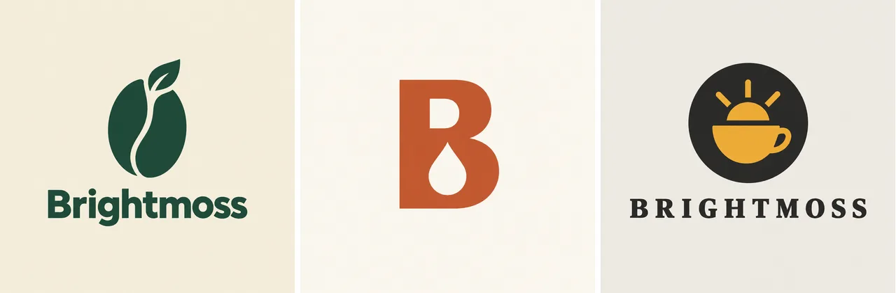
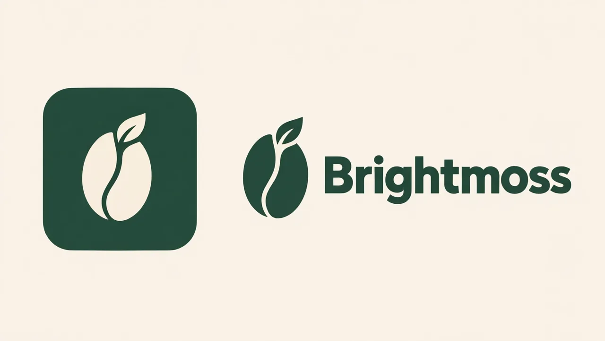

# AI Logo Maker Skill

English | [简体中文](./README.zh-CN.md)

Turn a brand name, industry, or reference image into logo concepts and a scalable brand mark, from inside Claude Code, Codex, or OpenClaw.

> [!IMPORTANT]
> Rendering needs a [Beatra](https://beatra.ai) account and uses credits. The skill itself is free to install.

| Question | Answer |
| --- | --- |
| **What it does** | Turn a brand name, industry, or reference image into a professional AI logo, brand mark, or app icon with multi-concept exploration, precise brand colors, and scalable composition. |
| **Requirements** | Python 3.10+ and an agent that loads `SKILL.md` |
| **Cost** | Free to install. Each render uses credits on your Beatra account, and paid steps run only when you ask for that exact render or approve its card. |
| **Works with** | Claude Code, Codex, OpenClaw |

<p align="center"></p>

*Three logo directions for a fictional specialty coffee roaster, Brightmoss: a bean-and-leaf combination mark, a B lettermark with a coffee-drop cutout, and a sun-over-cup emblem. AI-generated with Beatra.*

| Skill | Entry point | Version |
| --- | --- | --- |
| [`ai-logo-maker`](skills/ai-logo-maker) | [SKILL.md](skills/ai-logo-maker/SKILL.md) | 0.1.7 |

This repository is published automatically from [beatra-ai/beatra-skills](https://github.com/beatra-ai/beatra-skills/tree/main/skills/ai-logo-maker). Report issues there.

## Install

With the [`skills`](https://skills.sh) CLI:

```bash
npx skills add beatra-ai/ai-logo-maker-skill
```

With the GitHub CLI:

```bash
gh skill install beatra-ai/ai-logo-maker-skill ai-logo-maker
```

Or clone this repository and copy `skills/ai-logo-maker` into `~/.claude/skills/` for Claude Code,
`~/.agents/skills/` for Codex, or `~/.openclaw/skills/` for OpenClaw.

Or paste this into your agent:

```text
Install the ai-logo-maker skill from https://github.com/beatra-ai/ai-logo-maker-skill (folder skills/ai-logo-maker), then follow its SKILL.md to connect my Beatra account.
```

## Examples

<p align="center"></p>

*The chosen Brightmoss bean-and-leaf direction refined into an app icon and a horizontal wordmark lockup. AI-generated with Beatra.*

Prompt:

```text
Refine this accepted Brightmoss logo into a two-part brand presentation on one flat warm cream background (#F4EEE2). Left: an app icon, a solid rounded square in deep forest green (#1F4D3A) with the same coffee-bean-and-leaf symbol from the image centered inside in cream, generous padding, no text in the icon. Right: a horizontal lockup, the same green bean-and-leaf symbol placed to the left of the exact word "Brightmoss" in the same bold humanist sans-serif lettering, forest green, vertically centered with the symbol. Keep the symbol shape and the wordmark letterforms identical to the source. Flat vector, maximum two colors, no gradients, no shadows, no mockup, no tagline, no other text.
```

## What you get

- **Explore before you commit** — Generate multiple logo concepts from one brand brief, compare directions side by side, then refine the strongest. Professional logo design starts with options.
- **Built for every size** — Every concept is composed for favicon clarity, app icon precision, and social avatar impact. Strong silhouettes and limited palettes that stay recognizable from 16 pixels to billboard.
- **Your exact brand colors** — Lock precise brand colors with hex values and weighted palettes, so the logo carries your identity rather than a random color choice.

## Use cases

- **New business and startup logos** — Go from a company name and industry to a professional brand identity, with multiple concepts to compare before choosing a direction.
- **App icons and product marks** — Create square icons ready for app stores, favicons, software dashboards, and product launches—with safe-area margin built in.
- **Brand refresh from existing assets** — Transform sketches, mood boards, or an existing logo into a polished modern mark while preserving the original direction.
- **Social media and content branding** — Build profile avatars, watermarks, and a consistent visual identity that carries across platforms and content formats.

## FAQ

### What logo styles can I create?

Wordmarks, lettermarks, pictorial marks, abstract marks, monograms, emblems, and combination marks. Share the brand name, industry, and the feeling you want, and the best style for the context is recommended.

### Will my logo work as a tiny favicon?

Every concept is composed for small-size legibility with strong silhouettes, high contrast, and minimal detail. Review the result at thumbnail size before finalizing.

### Can I match my existing brand colors?

Yes. Provide hex color values and the logo generation uses them as the palette foundation, with precise weighted color control.

### Can I refine a logo I already have?

Yes. Upload the existing logo or sketch, describe what to change, and the refinement preserves the overall direction while adjusting specific elements.

## Updates

Each installed skill checks for a new version at most once a day, verifies the
official archive before replacing itself, and leaves your installation untouched
if anything fails. Turn it off at any time — see
`references/automatic-updates-and-safety.md` inside the skill.

## License

[MIT-0](LICENSE) — free to use, modify, and redistribute, including
commercially. No attribution required. Same terms as these skills carry on
ClawHub.
